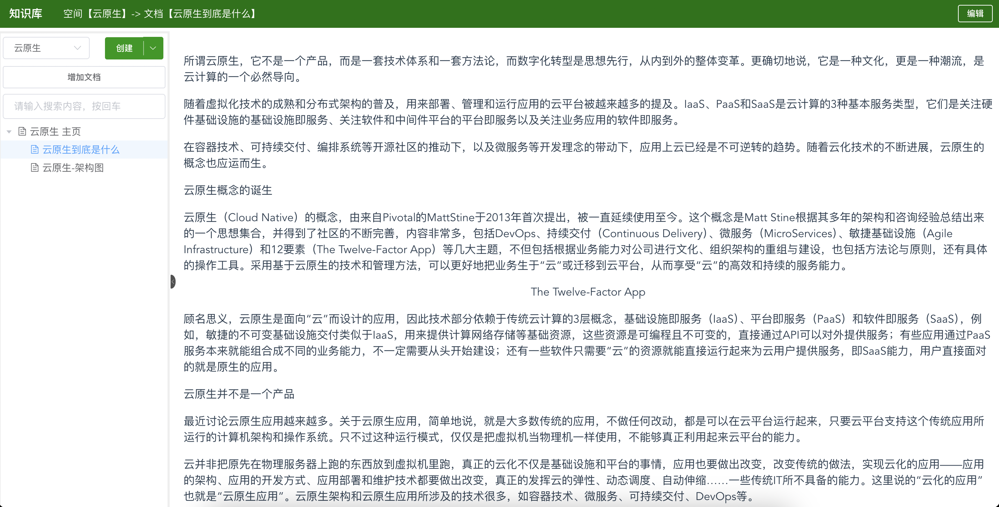
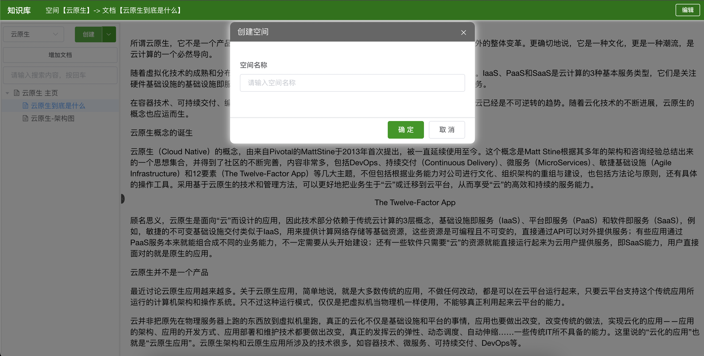
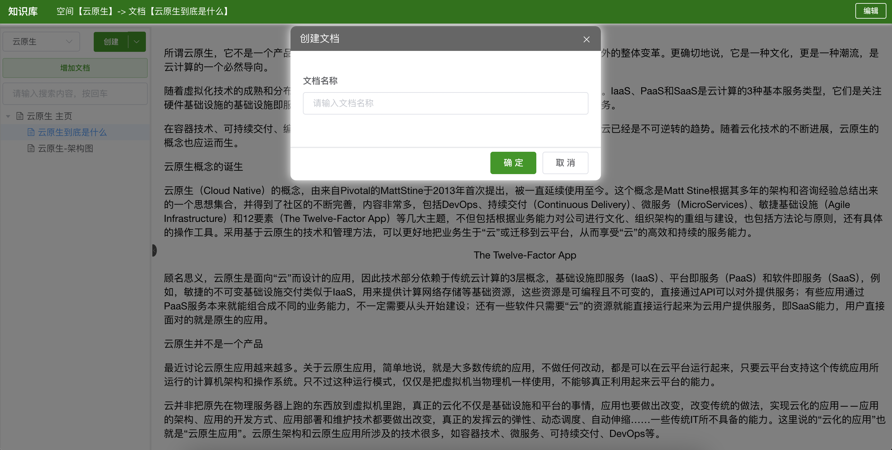
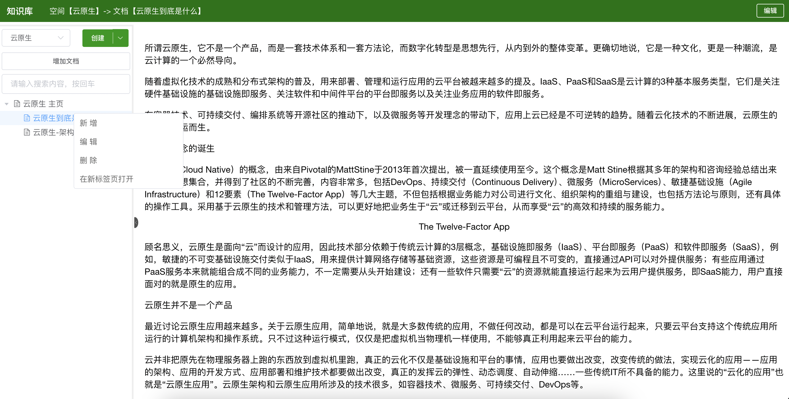
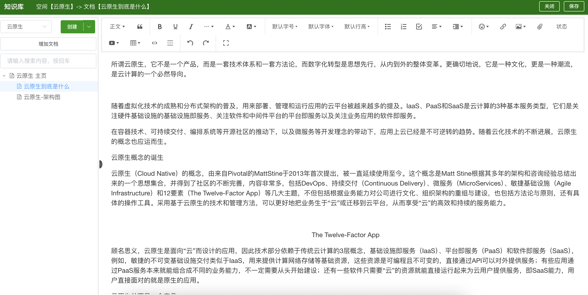

<!-- lang: java -->

	

<h1 align="center" style="margin: 30px 0 30px; font-weight: bold;">wiki v1.0.0</h1>
<h4 align="center">基于SpringBoot+Vue前后端分离的轻量级知识库</h4>

	
	

## 平台简介

知识库 企业或个人形成结构化、易操作、易利用、易储存、可传承的知识集群，这些知识不仅包括企业的宏观发展规划、企业文化等，也包含微观的各个部门的一切知识内容，如：培训资料、学习资料、客户资料、市场资料等等很多方面。同时与领域相关的理论知识、事实数据、市场动态新闻等知识，都在其内容之内。

主要功能包括：空间管理、页面管理、内容搜索、编辑页面、删除页面。

* 前端采用Vue、Element UI。
* 后端采用Spring Boot、Spring Security、Redis & Jwt。
* 权限认证使用Jwt，支持多终端认证系统。
* 支持加载动态权限菜单，多方式轻松权限控制。
* 高效率开发，使用代码生成器可以一键生成前后端代码。
* 提供了技术栈（[Vue3](https://v3.cn.vuejs.org) [Element Plus](https://element-plus.org/zh-CN) [Vite](https://cn.vitejs.dev)）版本。
* 特别鸣谢：[element](https://github.com/ElemeFE/element)，[vue-element-admin](https://github.com/PanJiaChen/vue-element-admin)，[eladmin-web](https://github.com/elunez/eladmin-web)。

## 团队产品
https://www.webusi.net

## 更新日志
### 1.0.1 规划中
1.  功能：页面权限
2.  功能：删除空间

### 1.0.0 2024-05-10
1.  功能：空间管理、页面管理、删除页面
2.  功能：内容搜索、编辑页面

## 核心功能
1.  空间管理：创建空间
2.  页面管理：新增页面、删除页面
3.  内容搜索：提供全文搜索
4.  编辑页面：提供编辑工具栏，所见即所得
5.  删除页面：删除页面
6.  历史记录：展示历史访问页面

## 基础功能

1.  用户管理：用户是系统操作者，该功能主要完成系统用户配置。
2.  部门管理：配置系统组织机构（公司、部门、小组），树结构展现支持数据权限。
3.  岗位管理：配置系统用户所属担任职务。
4.  菜单管理：配置系统菜单，操作权限，按钮权限标识等。
5.  角色管理：角色菜单权限分配、设置角色按机构进行数据范围权限划分。
6.  字典管理：对系统中经常使用的一些较为固定的数据进行维护。
7.  参数管理：对系统动态配置常用参数。
8.  通知公告：系统通知公告信息发布维护。
9.  操作日志：系统正常操作日志记录和查询；系统异常信息日志记录和查询。
10. 登录日志：系统登录日志记录查询包含登录异常。
11. 在线用户：当前系统中活跃用户状态监控。
12. 定时任务：在线（添加、修改、删除)任务调度包含执行结果日志。
13. 代码生成：前后端代码的生成（java、html、xml、sql）支持CRUD下载 。
14. 系统接口：根据业务代码自动生成相关的api接口文档。
15. 服务监控：监视当前系统CPU、内存、磁盘、堆栈等相关信息。
16. 缓存监控：对系统的缓存信息查询，命令统计等。
17. 连接池监视：监视当前系统数据库连接池状态，可进行分析SQL找出系统性能瓶颈。

## 演示图
<table>
    <tr>
        <td></td>
        <td></td>
    </tr>
    <tr>
        <td></td>
        <td></td>
    </tr>
    <tr>
        <td></td>
    </tr>
</table>

## 知识库交流

QQ： 43530640